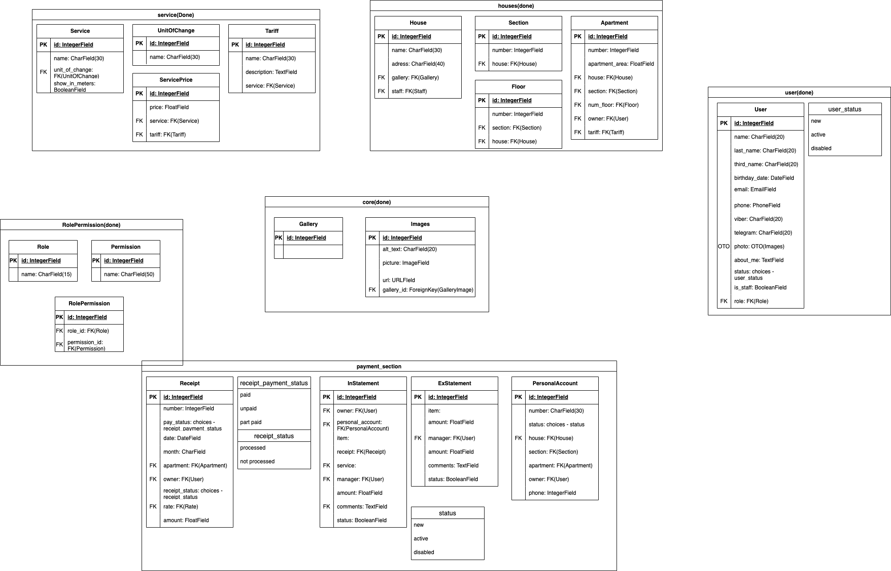

# MyHouse24

Property-management admin panel for residential complexes: houses and their
sections/floors, apartments and owners, service tariffs, personal accounts and
staff roles with granular permissions.

Built with Django 5 + PostgreSQL, with Celery/Redis handling transactional email
out of the request cycle.


## Screenshots

<!-- Додай 2-3 скріншоти у docs/screenshots/ і розкоментуй.
     Це найважливіша частина README для рекрутера. -->
<!--  -->
<!--  -->

## Stack

| Layer      | Choice                                             |
| ---------- | -------------------------------------------------- |
| Backend    | Django 5.1, Python 3.12                            |
| Database   | PostgreSQL 16                                      |
| Async      | Celery 5 + Redis                                   |
| Auth       | django-allauth (email-based, mandatory verification) |
| Frontend   | Django templates + AdminLTE, django-ajax-datatable |
| Tooling    | Poetry, Task, ruff, pytest, pre-commit, Docker     |

## Features

- Custom `User` model with email login and 19 granular permissions, grouped into
  roles and enforced through `StaffRequiredMixin`
- Houses with nested sections, floors and assigned staff, edited through inline
  formsets in a single atomic transaction
- Apartments with owners, tariffs and server-side filtered datatables
- Services, units of measurement, tariffs and per-tariff service pricing
- Personal accounts for residents
- Async transactional email through Celery, dispatched on transaction commit
- reCAPTCHA-protected signup

### Roadmap

- Payments section: receipts, incoming/outgoing statements (models done, UI pending)
- Statistics dashboard
- Master-application (service request) workflow

## Data model



## Quick start

```bash
cp .env.example .env_local        # заповни SECRET_KEY та решту
docker compose up --build
```

The app is served on <http://localhost:8000>. Create an admin account with:

```bash
docker compose exec web python manage.py createsuperuser
```

### Local development without Docker

Requires Python 3.12, PostgreSQL and Redis running locally.

```bash
poetry install --with dev
cp .env.example .env_local
task migrate
task runserver
task celery                       # в окремому терміналі
```

## Tests

```bash
task test                         # pytest --cov=src
```

`tests/test_access_control.py` walks the live URLConf and asserts that every
non-public view rejects anonymous requests, so newly added views are covered
without touching the test.

## Project layout

```
config/           settings, URLs, Celery app
src/
  core/           shared models (gallery) and access-control mixins
  users/          custom user model, auth flows, staff CRUD
  roles/          roles and permission mapping
  houses/         houses, sections, floors, staff assignment
  apartments/     apartments and owners
  service/        services, units, tariffs, personal accounts
  payments_section/  receipts and statements
  statistic/      dashboards
tests/            pytest suite
```

## License

MIT
